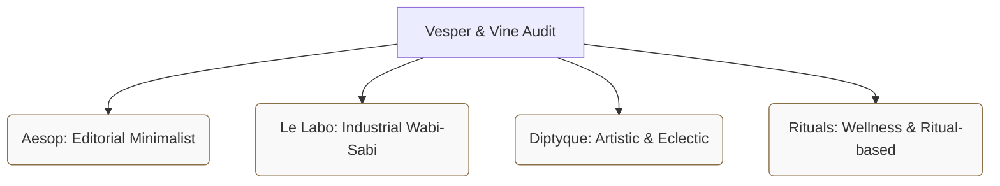
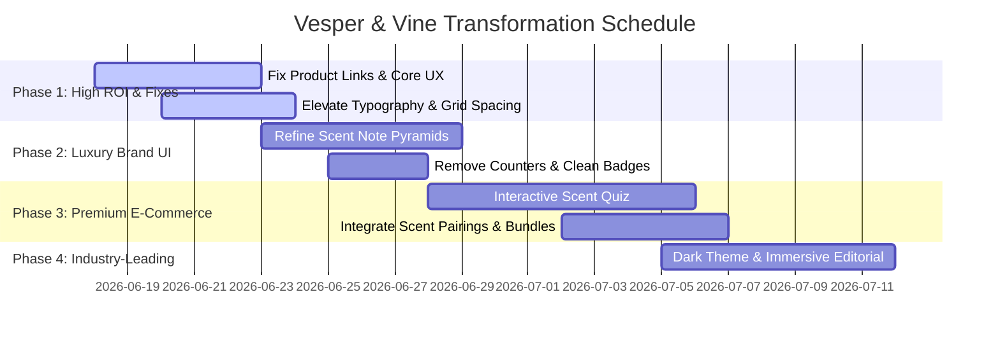

# BRAND & UX AUDIT REPORT: VESPER & VINE
**Prepared by:** Senior Product Designer, Brand Strategist, and Creative Director  
**Date:** June 17, 2026  
**Target:** Vesper & Vine — Premium Luxury Scent & Home Fragrance Brand

---

## Executive Summary

Vesper & Vine has a solid technical foundation with functional backend APIs, clean vanilla CSS animations, and modular client-side state management. However, when evaluated against luxury fragrance icons like **Aesop**, **Le Labo**, **Diptyque**, and **Byredo**, the site currently reveals its nature as a frontend development showcase rather than a premium, revenue-generating luxury brand. 

To bridge this gap, we must shift the user experience from **functional utility** (e.g., clicking check-boxes and sliding sliders) to **olfactory storytelling** and **emotional resonance**. 

This audit exposes the specific components that degrade the luxury aesthetic, analyzes competitor advantages, and outlines a high-impact, 4-phase strategic roadmap to prepare Vesper & Vine for a successful, high-conversion public launch.

---

## 1. What Makes It Feel Like a "Project" (Brutal Honesty)

To compete in the luxury market, we must eliminate elements that scream "portfolio template." Below are the key indicators currently holding the brand back:

| Element | Current State | Why it Feels Like a "Student Project" | Luxury Standard (Le Labo / Aesop / Diptyque) |
| :--- | :--- | :--- | :--- |
| **Broken Product Links** | All product cards on the `shop.html` page redirect to `product.html` via a hardcoded `onclick="window.location='product.html'"`. | Clicking on "Tuscan Leather" or "Midnight Fig" opens the Lavender & Wild Honey product details. This breaks the primary purchasing flow and reveals dummy routing. | Every card must resolve to its specific product path (`product.html?id=product-id`) dynamically or via clean server routing. |
| **The Tacky Scroll Counter** | The statistics section on the Homepage animates numbers from 0 to `10,000+` and `98%` on scroll. | Animating statistics counters is a hallmark of corporate agency landing page templates. Luxury brands never brag about volume or satisfaction percentages using interactive counters; they project quiet confidence. | Remove counters entirely. Replace with editorial copy focusing on heritage, atelier sourcing, and sourcing patience. |
| **Hardcoded "250+ Reviews"** | Every single product card has the exact text `(250+ reviews)` hardcoded into the HTML markup. | Flat-rate social proof counts feel lazy and fabricated, which immediately erodes consumer trust. | Reviews should display the actual count of reviews fetched from the database, or be omitted if reviews are sparse. |
| **Raw Text Press Logos** | The "Featured In" section uses hardcoded serif fonts (`VOGUE`, `Forbes`, `ELLE`) as plain text. | Real luxury brands use clean, unified, low-opacity vector SVGs of publisher logotypes to signal authentic editorial validation. Text-based labels look like a design placeholder. | Replace with a curated row of high-quality SVG logotypes styled in monochrome with low opacity (`0.4`), transitioning to `0.8` on hover. |
| **Dual Range Sliders & Heavy Filters** | The sidebar uses technical, heavy filter components: dual-range price sliders, burn-time sliders, and checkboxes. | High-end fragrance houses do not ask users to filter by "burn hours" or drag price thumbs. This treats a premium fragrance like a utility hardware product (e.g., searching for light bulbs). | Simplify filters to Scent Family (Woody, Floral, Fresh, Citrus) and Collection. Replace raw price/hour sliders with curated, editorial groupings. |
| **Interactive Cursor Glow** | A persistent CSS/JS cursor glow follow-effect (`.cursor-glow`) tracks the mouse. | Mouse-follow effects are common in portfolio sites to show JS mastery, but they add visual noise, lag mobile viewports, and distract from the product imagery. | Remove cursor glow entirely. Luxury branding favors whitespace, clean grids, and micro-interactions on elements, not floating neon spotlights. |
| **Hardcoded Checkout Forms** | Checkout flows and account setups feel siloed into simple client-side mocks or local storage variables. | A premium e-commerce company must show clear integration with secure checkout gateways (Apple Pay, Shop Pay, PayPal) and dynamic cart calculations. | Integrate standard, secure luxury express checkout options prominently in the drawer. |

---

## 2. Competitive Visual & Functional Analysis

We evaluated the current Vesper & Vine site against the digital boutiques of the world's most successful luxury scent brands:



### Aesop (The Benchmark for Editorial Minimalism)
*   **What they do:** Aesop uses a warm, earthy grid (sandy grays, dark olives) with generous, museum-like whitespace. Typography is strictly structured, utilizing a premium serif font paired with a clean, light sans-serif. Product listings feature extensive essays on formulation and application rather than checklists.
*   **Vesper & Vine Gap:** The current background color (`#F5F0EB`) is close to this palette, but the layout is cramped. The grids rely heavily on default Bootstrap columns. The fonts are imported from Google Fonts, but the spacing lacks the luxury "breathing room."

### Le Labo (The Benchmark for Customization & Wabi-Sabi)
*   **What they do:** Le Labo emphasizes the "freshly compounded in the lab" narrative. They allow customization of labels (names, messages, dates) and showcase the packaging process. Their digital design uses typewriter fonts (Courier-like) paired with stark industrial grids.
*   **Vesper & Vine Gap:** Vesper & Vine's "The Craft" section talks about pouring in micro-batches of nine, but this story is hidden in standard paragraphs. The interface does not highlight personalization, gifting, or batch numbers during the purchase path.

### Diptyque (The Benchmark for Artistic Heritage)
*   **What they do:** Diptyque focuses on hand-drawn oval illustrations and rich, eclectic histories of Paris. The scent is described through poetry and travel journals, creating an immediate sense of romantic wanderlust.
*   **Vesper & Vine Gap:** The current product copy describes "French lavender" and "wild fig orchard," but the presentation is a standard horizontal block of text. Scent notes are listed as simple bullet points (`Top`, `Heart`, `Base`) instead of an evocative olfactory pyramid or visual scent wheels.

---

## 3. High-Impact Brand Audits by Section

### A. Homepage & Hero Section
*   **Hero Imagery:** Currently uses a static image of a single candle. In luxury design, the hero should be an atmospheric video showing slow-burning wicks, swirling smoke, or high-end interiors (living room library, stone-tiled bathroom).
*   **Hero Copy:** "Consciously Crafted Scents" is good, but lacks emotional intensity. We need a stronger hook: *"Objects of scent. Vessels of light. Formulated for the modern sanctuary."*
*   **Trust Signals:** Placing a generic star rating badge *inside the hero overlay* cheapens the intro. Moving these elements into the footer or integrating them into a clean, low-profile announcement bar is much cleaner.

### B. Product Discovery & Filtering
*   **Scent Family Navigation:** Woody, Floral, Fresh, and Citrus should be discoverable using high-quality lifestyle imagery rather than standard sidebar checkboxes. Clicking "Woody" should morph the background palette or present an immersive editorial card.
*   **Interactive Scent Profile:** A luxury fragrance buyer wants to know if a candle is "warm, smoky, and heavy" or "green, crisp, and mineral." We need an interactive visual axis (Warm vs. Cold, Light vs. Dark) instead of simple checkboxes.

### C. Product Page (PDP)
```
[ Current Product Details Layout ]
+---------------------------------------+
|  [Main Image]      |  Lavender & Honey|
|                    |  $52.00          |
|  [Thumbnails]      |                  |
|                    |  [Add to Bag]    |
|                    |  [Buy It Now]    |
|--------------------+------------------|
|  [Scent Notes]     |  [Reviews]       |
+---------------------------------------+
```
*   **Olfactory Presentation:** Scent notes are critical. Simple text labels fail to convey the sensory experience. We should implement a visual Scent Pyramid or Scent Accord Wheel, depicting the evaporation levels of Top, Heart, and Base notes.
*   **Purchase Friction:** The "Buy It Now" button is styled as a generic blue button or a solid black block that lacks secondary styling refinement. The quantity controller feels standard and utility-driven.
*   **Upsells:** Scent pairings are completely missing. A user looking at "Lavender & Wild Honey" should be presented with a complementary linen spray, a brass wick trimmer, or a matching room diffuser as a structured "Scent Ritual" bundle.

### D. Cart & Checkout Drawer
*   **Friction Points:** The sliding offcanvas drawer is convenient, but the checkout buttons are standard Bootstrap elements.
*   **Upsell Placement:** The drawer doesn't offer quick-add scent samples or complimentary matches. High-end brands always prompt users to select a free vial sample of a different scent, which boosts future purchases.

### E. Account Dashboard
*   **Membership & Tier Presentation:** The current profile page has a rewards point bar. While functional, it looks like a typical retail gamification bar. A luxury brand refers to loyalty as a "Scent Guild" or "Sanctuary Circle," with milestones named after olfactory elements (e.g., *Suede Tier*, *Amber Tier*).
*   **Subscription Management:** The subscription card uses simple local storage states. Users should have a gorgeous, highly visual portal where they can swap their upcoming seasonal scent with a single click, choose their shipment cycle, and add limited-edition seasonal extras.

---

## 4. Brand Transformation Roadmap



### Phase 1: Highest ROI Improvements (UX & Credibility Fixes)
1.  **Dynamic Routing Repair:** Fix the shop page links. Clicking a card must pass the specific query parameter (`product.html?id=tuscan-leather`) to dynamic page rendering.
2.  **Typography & Spacing Overhaul:** Increase grid margins (`--space-4xl` to `--space-5xl`), increase letter-spacing on text, and refine the line height of headers to mirror Aesop's layout.
3.  **Sanitize Portfolio Artifacts:**
    *   Delete the scrolling JS statistics counter.
    *   Remove the floating CSS mouse-glow effect.
    *   Replace plain-text press mentions with grayscale SVG vector logos.
4.  **Drawer Checkout Elevate:** Revamp the checkout drawer layout with dedicated spaces for gift messages, free matchbook additions, and shipping threshold progress indicators.

### Phase 2: Luxury Brand Storytelling
1.  **Visual Scent Pyramid:** Add an interactive CSS/SVG graphic on the PDP showcasing Top, Heart, and Base notes with delicate hover animations explaining each note's evaporation rate and source.
2.  **Batch & Sourcing Metadata:** Add a dedicated "Atelier Details" block on the PDP:
    *   *Pour Date:* Current Season
    *   *Batch Size:* Micro-batch of 9
    *   *Chandler Initial:* Signed digitally
3.  **Customer Scent Gallery:** Replace static social proof boxes with a clean, low-profile masonry grid showing real customer photos, tagged with the specific candle scent they are burning.

### Phase 3: Premium E-Commerce Features
1.  **Signature Scent Quiz:** Create an elegant, full-screen step-by-step diagnostic questionnaire ("Find Your Sanctuary Scent") asking about space size, mood preferences (Restorative vs. Stimulating), and favorite seasons.
2.  **Ritual Bundling:** Allow customers to build a "Scent Ritual" (Candle + Matches + Brass Trimmer) directly from the product page with a single click, saving 15% on the bundle.
3.  **Subscription Personalization Portal:** Redesign the account subscription section to allow easy scent swapping, delivery calendar views, and "skip shipment" animations.

### Phase 4: Industry-Leading Scent Experiences
1.  **Immersive Dark Editorial Theme:** Introduce a system-wide theme switch that transitions the background from a warm stone cream to a deep, charcoal clay. This heightens the emotional feeling of sunset and nighttime ritual candle burning.
2.  **Seasonal Discovery Program:** Build an interactive page detailing the seasonal scent rotation subscription, allowing users to preview upcoming notes and lock in limited-edition batches.
3.  **Interactive Scent Journal:** Create a magazine-style storytelling section on the website that combines cultural essays, candle-care instructions, and poetry with direct, subtle buy links.

---

## 5. Verification & Quality Assurance Plan

To ensure the changes maintain technical excellence while delivering a premium aesthetic:

### Automated Tests
*   Run accessibility audits (Lighthouse / AXE) targeting color contrast ratios, especially when transitioning to dark modes.
*   Ensure the dynamic route loader correctly handles invalid or missing query strings without breaking the page layout.
*   Validate CSS grid responsiveness across common mobile widths (360px - 428px).

### Manual Verification
*   Verify that adding items to the bag from different PDP pages updates the cart count and drawer subtotal correctly.
*   Test form submissions (reviews, newsletters) with invalid formats to ensure custom, elegant error messages appear instead of default browser alerts.
*   Audit transitions and hover animations on a physical mobile device to guarantee smooth, jitter-free performance.
